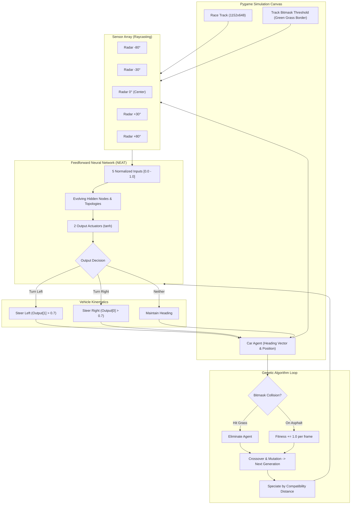

# 🏎️ Autonomous AI Car Simulation via NeuroEvolution (NEAT)

[](https://github.com/harshit0074/ai-car/actions/workflows/ci.yml)
[](https://www.python.org/)
[](https://opensource.org/licenses/MIT)
[](https://pyga.me/)
[-green.svg)](http://nn.cs.utexas.edu/?stanley:ec02)
[](https://flake8.pycqa.org/)

> An autonomous self-driving vehicle simulation built in Python using **Pygame** and **NEAT (NeuroEvolution of Augmenting Topologies)**. The agents learn to navigate complex, winding race tracks from scratch using simulated multi-angle raycast radar (LIDAR) telemetry, dynamic artificial neural network topology generation, and 2D bitmask physics.

---

## 📑 Table of Contents
- [Project Overview](#-project-overview)
- [💼 Resume & Portfolio Highlights](#-resume--portfolio-highlights)
- [✨ Key Features](#-key-features)
- [🏗️ System Architecture](#️-system-architecture)
- [🔬 How It Works (The Science Behind It)](#-how-it-works-the-science-behind-it)
  - [1. Simulated Raycast LIDAR / Radar](#1-simulated-raycast-lidar--radar)
  - [2. Neural Network Topology](#2-neural-network-topology)
  - [3. The NEAT Genetic Algorithm](#3-the-neat-genetic-algorithm)
  - [4. Fitness Function Formulation](#4-fitness-function-formulation)
- [🏁 Benchmark Tracks](#-benchmark-tracks)
- [🚀 Quickstart & Installation](#-quickstart--installation)
- [💻 CLI Usage & Commands](#-cli-usage--commands)
- [⚙️ Hyperparameter Tuning (`config.txt`)](#️-hyperparameter-tuning-configtxt)
- [📂 Repository Structure](#-repository-structure)
- [🗺️ Roadmap](#️-roadmap)
- [👤 Author & License](#-author--license)

---

## 🌟 Project Overview

Traditional reinforcement learning methods often require dense reward shaping and thousands of episodes to converge on continuous control tasks. **NeuroEvolution of Augmenting Topologies (NEAT)** tackles this problem by evolving both connection weights and network structure simultaneously.

In this simulation, a generation of 100 autonomous cars is spawned on an unseen track. Without any prior rules or human driving demonstrations, the cars learn through natural selection:
1. Agents that collide with track borders are eliminated immediately.
2. Agents that navigate curves and stay on the asphalt road gain higher fitness scores.
3. The fittest neural networks pass their topological structures and connection weights to the next generation via crossover and mutation.
4. Within **10 to 20 generations**, the population develops sophisticated driving strategies, apex-cornering behaviors, and high-speed stability.

---

## 💼 Resume & Portfolio Highlights

If you are showcasing this project on your resume, LinkedIn, or interview portfolio, here are tailored, impactful bullet points:

* **Autonomous Driving Simulation**: Engineered an autonomous agent simulation using **NEAT** (NeuroEvolution of Augmenting Topologies) and **Pygame**, training neural agents to master complex race tracks in under 20 generations.
* **Simulated Sensor Array (Raycasting LIDAR)**: Developed a real-time 5-channel raycasting radar array (-80°, -30°, 0°, +30°, +80°) detecting track boundaries via bitmask thresholding with Euclidean distance normalization.
* **Genetic Algorithm & Topological Evolution**: Implemented dynamic neural network evolution with speciation, innovation tracking, topological mutation (node/connection insertion), and elitist crossover.
* **Pixel-Perfect Collision Physics**: Integrated 2D vector kinematics and Pygame surface bitmask overlap algorithms (`pygame.mask.from_threshold`) for sub-pixel boundary detection at 60+ FPS.
* **Model Serialization & Multi-Track Benchmarking**: Architected CLI pipeline supporting model checkpointing (`pickle`), zero-training inference replay, and multi-track evaluation across 5 distinct track geometries.

---

## ✨ Key Features

* 📡 **5-Channel Raycasting Radar**: Emits ray marches in 5 directions to gauge distances to track borders in real time, rendering diagnostic rays on the display.
* 🧠 **Unconstrained Neural Topology**: Starts with zero hidden nodes and evolves novel hidden layers and synaptic connections as needed, minimizing parameter bloat.
* ⚡ **Zero-Training Inference Mode**: Pre-trained champion models can be serialized and replayed with a single command (`--test champion.pkl`).
* 🏎️ **Multi-Track Suite**: Includes 5 unique track topologies featuring hairpin curves, chicanes, narrow bottlenecks, and high-speed straights.
* 📊 **Live Telemetry HUD**: Real-time Heads-Up Display monitoring generation count, active agent count, peak fitness score, and current track metadata.
* 🛠️ **Configurable Simulation Rates**: Train at an uncapped framerate (`--fps 0`) for rapid multi-generation evolution, or lock to 60 FPS for visual demonstration.
* 🛡️ **Automated CI/CD Pipeline**: GitHub Actions workflow automatically verifies Python syntax, dependency resolutions, and NEAT configuration integrity on every commit.

---

## 🏗️ System Architecture



---

## 🔬 How It Works (The Science Behind It)

### 1. Simulated Raycast LIDAR / Radar
Each vehicle acts as an autonomous agent equipped with 5 rangefinder sensors:
$$\theta_{\text{sensor}} \in \{-80^\circ, -30^\circ, 0^\circ, +30^\circ, +80^\circ\}$$

For each angle, a ray is projected outward from the vehicle's center $(c_x, c_y)$ step-by-step along:
$$x(l) = c_x + l \cdot \cos(\theta_{\text{heading}} + \theta_{\text{sensor}})$$
$$y(l) = c_y - l \cdot \sin(\theta_{\text{heading}} + \theta_{\text{sensor}})$$

The ray marches until it hits the track boundary color (`RGB(2, 105, 31)`) or reaches `RADAR_MAX_LENGTH = 200` pixels. The measured distance is then normalized to $[0.0, 1.0]$:
$$s_i = \frac{l_i}{200.0}$$

### 2. Neural Network Topology
* **Inputs (5 Nodes)**: Normalized sensor readings $s_0, s_1, s_2, s_3, s_4$.
* **Outputs (2 Nodes)**:
  * `Output[0]`: Right steer trigger threshold ($> 0.7$).
  * `Output[1]`: Left steer trigger threshold ($> 0.7$).
* **Activation**: Hyperbolic tangent ($\tanh$).
* **Initial Connection**: Unconnected (complexification starts minimal).

### 3. The NEAT Genetic Algorithm
Unlike standard fixed-topology neural networks, NEAT begins with minimal structure and introduces complexity incrementally:
* **Historical Markings (Innovation Numbers)**: Solves the *competing conventions* problem, allowing meaningful crossover between disparate topological structures.
* **Speciation**: Genomes are grouped into species based on topological compatibility distance:
  $$\delta = \frac{c_1 E}{N} + \frac{c_2 D}{N} + c_3 \cdot \bar{W}$$
  *(where $E$ = excess genes, $D$ = disjoint genes, $\bar{W}$ = average weight difference).*
  This protects newly introduced structural mutations from being eliminated before having a chance to optimize.
* **Topological Mutations**: Random insertion of new connection pathways (30% probability) and new hidden nodes (20% probability).

### 4. Fitness Function Formulation
To incentivize speed, track survival, and progressive lap navigation:
$$\text{Fitness}(g) = \sum_{t=0}^{T_{\text{alive}}} 1.0 + \alpha \cdot \text{distance\_traveled}$$
* Agents receive continuous reward for every frame they remain on the road.
* Crashing into the grass immediately terminates evaluation for that agent without penalizing previous generations.

---

## 🏁 Benchmark Tracks

All tracks are sized at **1152 × 648** with identical starting coordinates `(464, 480)` and asphalt color profiles, enabling instant cross-track generalization tests:

| Track | Image | Description | Difficulty |
| :--- | :--- | :--- | :--- |
| **Track 1** | `assets/tracks/track1.png` | Standard oval circuit with gentle banking curves. Perfect for initial convergence. | 🟢 Beginner |
| **Track 2** | `assets/tracks/track2.png` | Technical circuit with alternating left/right S-bends and variable track widths. | 🟡 Intermediate |
| **Track 3** | `assets/tracks/track3.png` | High-speed track with sweeping radii and tightening apexes. | 🟡 Intermediate |
| **Track 4** | `assets/tracks/track4.png` | Sharp 90-degree corners demanding acute radar distance appraisal. | 🔴 Advanced |
| **Track 5** | `assets/tracks/track5.png` | Complex grand-prix layout testing long-horizon survival and corner entry speed. | 🟣 Expert |

---

## 🚀 Quickstart & Installation

### Prerequisites
* **Python 3.10+** (Tested on Python 3.10, 3.11, 3.12, 3.14)
* Git

### Step-by-Step Setup

```bash
# 1. Clone the repository
git clone https://github.com/harshit0074/ai-car.git
cd ai-car

# 2. Create a virtual environment
python -m venv .venv

# 3. Activate the virtual environment
# Windows (PowerShell):
.venv\Scripts\Activate.ps1
# Windows (CMD):
.venv\Scripts\activate.bat
# Linux / macOS:
source .venv/bin/activate

# 4. Install dependencies
pip install -r requirements.txt
```

---

## 💻 CLI Usage & Commands

The project includes an intuitive command-line interface via `main.py`:

```bash
python main.py [OPTIONS]
```

### Command-Line Arguments

| Flag | Full Option | Type | Default | Description |
| :--- | :--- | :--- | :--- | :--- |
| `-t` | `--track` | `str` | `1` | Select track: `1` to `5` or path to custom image. |
| `-g` | `--generations` | `int` | `50` | Number of evolutionary generations to execute. |
| `-s` | `--save-best` | `str` | `champion.pkl` | Destination filepath to save the winning genome. |
| | `--test` | `str` | `None` | Path to a pre-trained `.pkl` model to replay directly. |
| | `--fps` | `int` | `60` | Framerate limit (`0` for uncapped high-speed training). |
| `-c` | `--config` | `str` | `config.txt` | Path to custom NEAT configuration file. |

### Practical Examples

**1. Run Default Training (Track 1, 60 FPS, 50 Generations):**
```bash
python main.py
```

**2. High-Speed Training (Uncapped FPS on Track 2):**
```bash
python main.py --track 2 --fps 0 --generations 100 --save-best champion_track2.pkl
```

**3. Challenge an Advanced Circuit (Track 4):**
```bash
python main.py --track 4 --generations 75
```

**4. Replay a Saved Champion Model (Zero Training Inference):**
```bash
python main.py --test champion.pkl --track 1
```

---

## ⚙️ Hyperparameter Tuning (`config.txt`)

Key evolutionary parameters defined in `config.txt`:

| Section | Parameter | Value | Rationale |
| :--- | :--- | :--- | :--- |
| `[NEAT]` | `pop_size` | `100` | Ample genetic diversity per generation without rendering lag. |
| `[NEAT]` | `fitness_threshold` | `10000` | Target fitness defining successful track mastery. |
| `[DefaultGenome]` | `num_inputs` | `5` | 5 radar sensors at `[-80, -30, 0, 30, 80]` degrees. |
| `[DefaultGenome]` | `num_outputs` | `2` | `[Steer Right, Steer Left]` actuators. |
| `[DefaultGenome]` | `activation_default` | `tanh` | Normalizes hidden/output activations between `[-1.0, 1.0]`. |
| `[DefaultGenome]` | `conn_add_prob` | `0.30` | 30% probability of creating novel synaptic connections. |
| `[DefaultGenome]` | `node_add_prob` | `0.20` | 20% probability of inserting a hidden layer neuron. |
| `[DefaultSpeciesSet]` | `compatibility_threshold`| `3.0` | Controls species niche separation and speciation boundaries. |

---

## 📂 Repository Structure

```
ai-car/
│
├── .github/
│   └── workflows/
│       └── ci.yml             # Automated CI pipeline for linting & tests
│
├── assets/
│   ├── car.png                # High-resolution vehicle sprite
│   ├── track.png              # Default race track surface
│   └── tracks/                # Multi-track benchmark suite
│       ├── track1.png         # Track 1: Standard Oval
│       ├── track2.png         # Track 2: Double Chicane
│       ├── track3.png         # Track 3: Sweeping Apexes
│       ├── track4.png         # Track 4: 90° Corner Challenge
│       └── track5.png         # Track 5: Grand Prix Layout
│
├── .flake8                    # Flake8 linter configuration
├── .gitignore                 # Excludes venv, pycache, OS & IDE artifacts
├── config.txt                 # NEAT algorithm configuration & hyperparameters
├── LICENSE                    # MIT Open-Source License
├── main.py                    # Core simulation engine, CLI, physics & NEAT loop
├── requirements.txt           # Project dependencies
└── README.md                  # Comprehensive project documentation
```

---

## 🗺️ Roadmap

- [x] **5-Channel Raycasting Telemetry**
- [x] **Bitmask Pixel-Accurate Collision Physics**
- [x] **Live Heads-Up Display (HUD)**
- [x] **Multi-Track Benchmark Selection (Tracks 1-5)**
- [x] **Model Serialization (`--save-best` and `--test`)**
- [x] **GitHub Actions Automated CI/CD**
- [ ] **Dynamic Obstacles**: Introduce moving/stationary obstacles to test reactive obstacle avoidance.
- [ ] **Reinforcement Learning Benchmark**: Train a Deep Q-Network (DQN) or PPO agent to compare sample efficiency against NEAT.
- [ ] **Lap Timer & Checkpoint System**: Micro-sector checkpoint splits for lap time optimization.

---

## 👤 Author & License

Developed by **Harshit** ([@harshit0074](https://github.com/harshit0074)).

Distributed under the **MIT License**. See [`LICENSE`](LICENSE) for details. Contributions, feature suggestions, and pull requests are warmly welcome!
